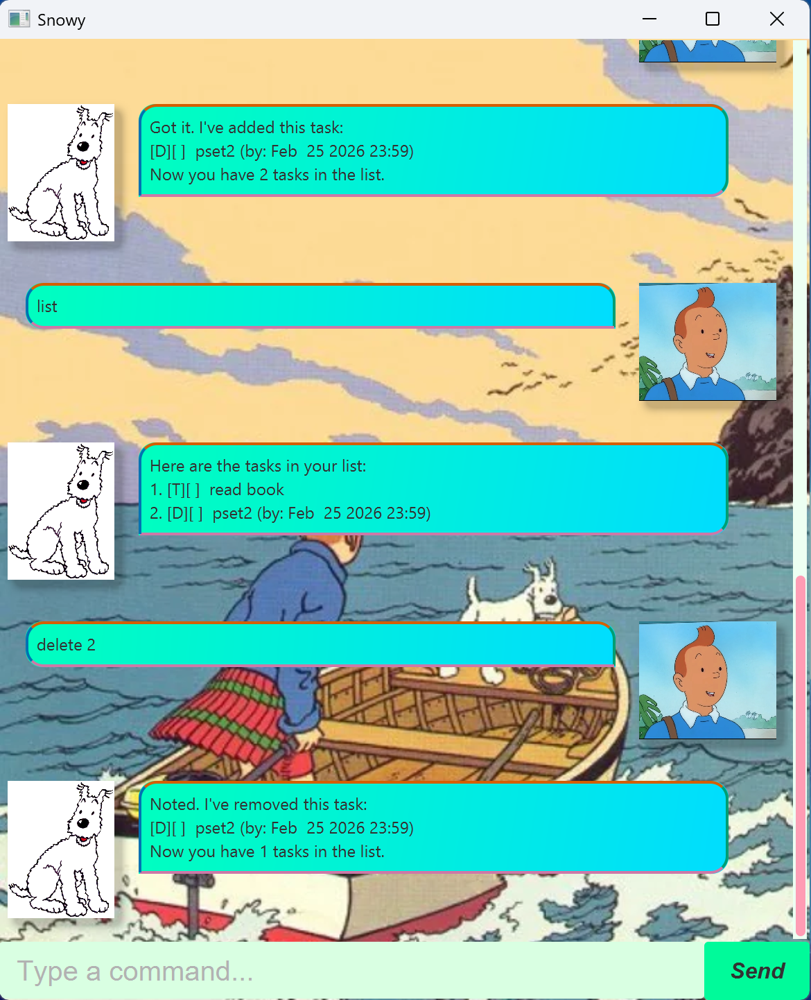

# Snowy

Snowy is a task management chatbot application that helps you keep track of todos, deadlines, and events. It's named after the pet dog of the famous comic character TinTin!



## Features

- **Todo tasks**: Simple tasks without deadlines
- **Deadline tasks**: Tasks with a specific due date and time
- **Event tasks**: Tasks with a start and end time
- **Mark/Unmark**: Track task completion status
- **Find**: Search for tasks by keyword
- **Date filtering**: View tasks occurring on a specific date
- **Sorted view**: View all tasks grouped by type and sorted chronologically
- **Persistent storage**: Tasks are automatically saved to file

## Setting up in IntelliJ

Prerequisites: JDK 17 or later, update IntelliJ to the most recent version.

1. Open IntelliJ (if you are not in the welcome screen, click `File` > `Close Project` to close the existing project first)
2. Open the project into IntelliJ as follows:
   1. Click `Open`.
   2. Select the project directory, and click `OK`.
   3. If there are any further prompts, accept the defaults.
3. Configure the project to use **JDK 17** (not other versions) as explained in [here](https://www.jetbrains.com/help/idea/sdk.html#set-up-jdk).
   In the same dialog, set the **Project language level** field to the `SDK default` option.
4. After that, locate the `src/main/java/snowy/Launcher.java` file, right-click it, and choose `Run Launcher.main()`. If the setup is correct, the Snowy chat window should appear.

## Running the Application

### Using Gradle
```bash
# Build the project
./gradlew build

# Run the application
./gradlew run

# Create JAR file
./gradlew shadowJar
```

### Using JAR file
```bash
java -jar snowy.jar
```

## Usage

Type commands into the input box at the bottom of the chat window and press Enter or click Send.

### Adding tasks

**Todo:**
```
todo read book
```

**Deadline:**
```
deadline submit assignment /by 2024-12-25 1800
```

**Event:**
```
event team meeting /from 2024-12-25 1000 /to 2024-12-25 1200
```

### Managing tasks

**List all tasks:**
```
list
```

**List all tasks in sorted order:**
```
sortedlist
```
Tasks are grouped by type (Todos → Deadlines → Events). Within each group,
Deadlines and Events are sorted chronologically by date. Todos maintain
their original insertion order. Note that `sortedlist` does not modify
the underlying task list — use `list` to see the original order.

**Mark task as done:**
```
mark 1
```

**Unmark task:**
```
unmark 1
```

**Delete task:**
```
delete 1
```

**Find tasks:**
```
find book
```

**View tasks on a date:**
```
on 2024-12-25
```

**Exit:**
```
bye
```

[//]: # (Claude AI was used here to generate the command summary)
## Command Summary

| Command | Format | Example |
|---------|--------|---------|
| Add Todo | `todo DESCRIPTION` | `todo read book` |
| Add Deadline | `deadline DESCRIPTION /by DATE TIME` | `deadline return book /by 2024-12-25 1800` |
| Add Event | `event DESCRIPTION /from DATE TIME /to DATE TIME` | `event project meeting /from 2024-12-25 1400 /to 2024-12-25 1600` |
| List | `list` | `list` |
| Sorted List | `sortedlist` | `sortedlist` |
| Mark | `mark INDEX` | `mark 2` |
| Unmark | `unmark INDEX` | `unmark 2` |
| Delete | `delete INDEX` | `delete 3` |
| Find | `find KEYWORD` | `find book` |
| View by date | `on DATE` | `on 2024-12-25` |
| Exit | `bye` | `bye` |

**Date format:** `yyyy-MM-dd` (e.g., 2024-12-25)  
**Time format:** `HHmm` (e.g., 1800 for 6:00 PM)

[//]: # (Claude AI was used here to generate the project structure tree)
## Project Structure
```
src/
├── main/
│   ├── java/
│   │   └── snowy/
│   │       ├── Launcher.java       # Entry point
│   │       ├── Main.java           # JavaFX application
│   │       ├── MainWindow.java     # Main window controller
│   │       ├── DialogBox.java      # Chat dialog component
│   │       ├── Snowy.java          # Chatbot logic
│   │       ├── task/               # Task-related classes
│   │       ├── storage/            # File I/O operations
│   │       ├── parser/             # Command parsing
│   │       ├── tasklist/           # Task list management
│   │       └── exception/          # Custom exceptions
│   └── resources/
│       ├── css/                   #  CSS files
│       └── images/                 # UI images
│       └── view/                   # FXML layout files
└── test/
    └── java/
        └── snowy/                  # JUnit tests
```

## Acknowledgements

This project was developed as part of CS2103 Software Engineering module at NUS.